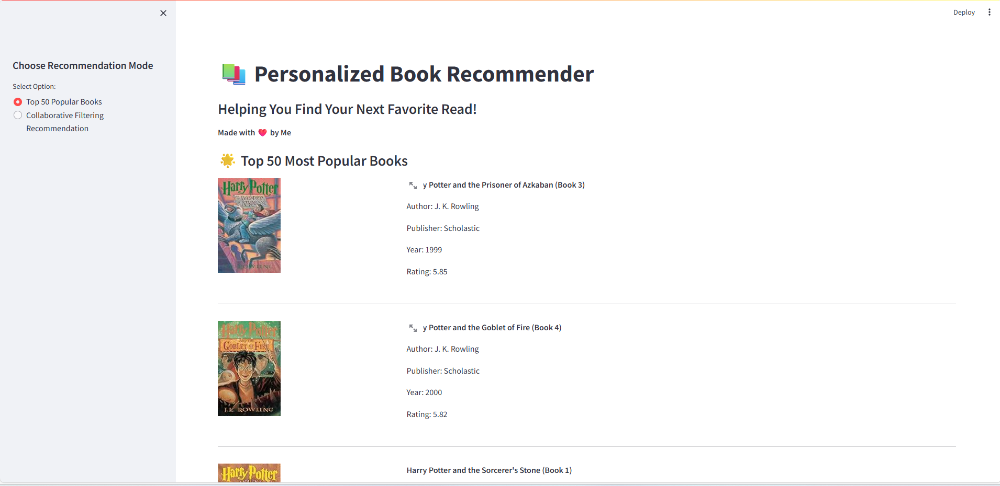
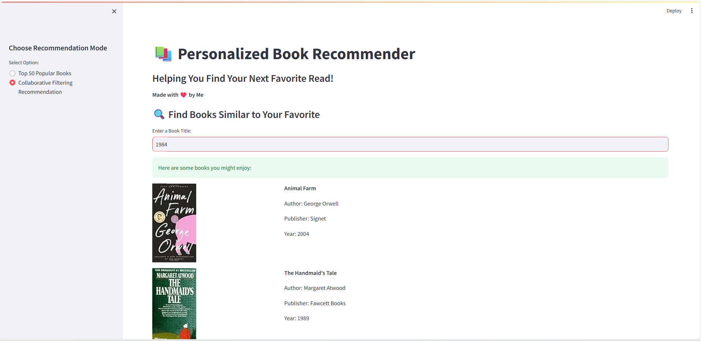

---

# 📚 Book Recommender System

A **Streamlit-powered Web Application** that recommends books based on two models: **Popularity-Based** and **Collaborative Filtering**. Whether you want to explore the most popular books or receive personalized suggestions based on your favorite read, this app is designed to enhance your reading journey.

---

## 🚀 Features

* 🎯 **Top 50 Most Popular Books**
  Discover the most loved and highly rated books from the dataset.

* 🤝 **Collaborative Filtering Recommender**
  Get personalized book recommendations based on what you like!
  Just enter the name of a book you enjoyed — the system will suggest similar books (along with details like title, author, publisher, year, and cover image).

* 🔍 **Interactive Streamlit Web Interface**
  Clean, minimal, and professional interface for smooth user interaction.

---

## 🏗️ Project Structure

```
📦 Book Recommender System/
│
├── app.py                 # Main Streamlit app
├── popularity.pkl         # Precomputed Top 50 books data
├── pt.pkl                 # Pivot table for collaborative filtering
├── similarity.pkl         # Cosine similarity matrix for recommendations
├── book.pkl               # Book metadata (title, author, year, publisher, image)
├── requirements.txt       # Required Python packages

```

---

## 🧩 Model Details

### 1. **Popularity-Based Recommendation**

* Recommends the top 50 books based on:

  * Number of ratings
  * Average rating
* Preprocessed and stored in `popular.pkl`.

### 2. **Collaborative Filtering-Based Recommendation**

* Uses **cosine similarity** over the user-book pivot table (`pt.pkl`).
* Computes the similarity between books to recommend items similar to the input book.
* Outputs:

  * **Book Title**
  * **Author**
  * **Publisher**
  * **Year of Publication**
  * **Cover Image**

---

## 💻 How to Run Locally

1. **Clone the Repository:**

```bash
git clone https://github.com/Gur07/Book_Recommender.git
cd Book_Recommender
```

2. **Install Dependencies:**

```bash
pip install -r requirements.txt
```

3. **Run Streamlit App:**

```bash
streamlit run app.py
```

---

## 🎨 Screenshots

| Top 50 Books                                                           | Collaborative Filtering                                                         |
| ---------------------------------------------------------------------- | ------------------------------------------------------------------------------- |
|                                       |  |

---

## 🔮 Future Improvements

* User login & personalized history
* Genre-based filtering
* Real-time rating updates
* Integration with online book APIs (e.g., Google Books)

---

## 🤝 Acknowledgements

* Dataset: https://www.kaggle.com/datasets/arashnic/book-recommendation-dataset
* Libraries: `Streamlit`, `Pandas`, `Scikit-learn`

---


### 💡 *“A reader lives a thousand lives before he dies. The man who never reads lives only one.” — George R.R. Martin*

---
